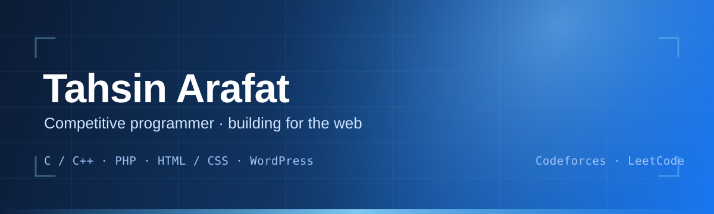

<h1 align="center">
   
  Tahsin Arafat
</h1>

<i>Competitive programmer · learning more algorithms · building for the web</i>

  
  
  
  
  

---

## 🔵 Intro

> 💬 I'm currently involved in **competitive programming**, learning more algorithms one problem at a time.
>
> 🧩 Building tools and web projects with **C/C++, PHP, TypeScript, and WordPress**
> 🤝 Open to collaboration

---

## 🚀 What I'm Building

My most substantial work.

| Project | What it is | Stack |
| --- | --- | --- |
| **[AIOJ](https://github.com/TahsinArafat/AIOJ)** | Full-featured, self-hostable competitive programming platform — Go backend, React SPA, PostgreSQL, Docker-isolated code execution | `Go` `TypeScript` |
| 🔒 **sleepy-ai** | *Private repository* | — |
| **[SleepyCode-VSCode](https://github.com/TahsinArafat/SleepyCode-VSCode)** | VS Code extension for the SleepyCode AI coding assistant | `TypeScript` |
| **[sleepy-code](https://github.com/TahsinArafat/sleepy-code)** | Terminal-native AI coding assistant with specialist primary agents and persistent cross-session project memory | `TypeScript` |
| 🔒 **JinnChat** | *Private repository* | — |
| 🔒 **JinnChat-Android** | *Private repository* | — |
| 🔒 **JinnLipi-Android** | *Private repository* | — |
| **[WitDiff](https://github.com/TahsinArafat/WitDiff)** | Deterministic verification for AI-written code — proves a change via red/green regression tests with machine-readable receipts | `Rust` |
| **[citegen](https://github.com/TahsinArafat/citegen)** | WordPress plugin that auto-generates APA & MLA citations for posts and pages, with style selection and copy | `PHP` |
| **[footnotes-reloaded](https://github.com/TahsinArafat/footnotes-reloaded)** | Maintained fork of the abandoned footnotes WordPress plugin, updated for WP 6.7+ / PHP 8.0+ | `PHP` |

  

---

## 🌐 Find me

| Platform | Link |
| --- | --- |
| Facebook | [facebook.com/TahsinArafat03](https://facebook.com/TahsinArafat03) |
| LinkedIn | [linkedin.com/in/tahsin-arafat](https://linkedin.com/in/tahsin-arafat) |
| Codeforces | [codeforces.com/profile/TahsinArafat](https://codeforces.com/profile/TahsinArafat) |
| LeetCode | [leetcode.com/u/TahsinArafat](https://leetcode.com/u/TahsinArafat/) |

---

## 📊 Highlights

### ⚡ GitHub stats

  
  
  

### 🎯 Competitive programming

  
  

---

## 🛠 Tech Stack

